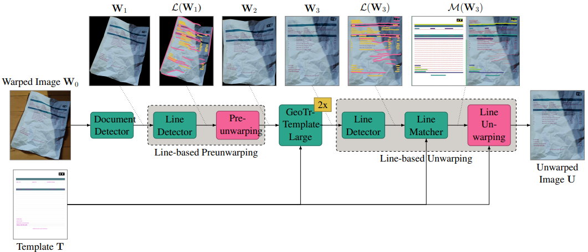

# DocMatcher

This repository contains the models and inference, training and evaluation code of our [paper](https://felixhertlein.github.io/doc-matcher/) which was presented at the IEEE/CVF Winter Conference on Applications of Computer Vision ([WACV](https://wacv2025.thecvf.com/)) 2025.

For more details see our project page [project page](https://felixhertlein.github.io/doc-matcher/).



## Usage

### VS-Code Devcontainer

We highly recommend to use the provided Devcontainer to make the usage as easy as possible:

- Install [Docker](https://www.docker.com/) and [VS Code](https://code.visualstudio.com/)
- Install VS Code Devcontainer extension `ms-vscode-remote.remote-containers`
- Clone the repository
  ```shell
  git clone https://github.com/FelixHertlein/inv3d-model.git
  ```
- Press `F1` (or `CTRL + SHIFT + P`) and select `Dev Containers: Rebuild and Reopen Container`
- Open a new terminal in VS Code

## Inference

### Start the inference

`python inference.py --model docmatcher@inv3d --dataset inv3d_real --gpu 0`

### Models

The models will be downloaded automatically before the inference starts.

Available models are:

- identity
- dewarpnet@inv3d
- geotr@inv3d
- geotr_template@inv3d
- geotr_template_large@inv3d
- docmatcher@inv3d

### Datasets

#### Inv3DReal

Inv3DReal will be automatically downloaded when starting an inference with this dataset.

#### Custom dataset

To unwarp your own data, you can mout your data inside the container using the `.devcontainer/devcontainer.json` config.

Mount your data folder to `/workspaces/doc-matcher/input/custom_datasets/YOUR_DATA_DIRECTORY`.
Make sure, all images start with the prefix `image_` and the corresponding templates (only for template-based models) with the prefix `template_`.
This repository contains an example for an custom data set.

### Output: Unwarped images

All unwarped images are placed in the `output` folder.

### Help

```
inference.py [-h]
--model {
  identity,
  dewarpnet@inv3d,
  geotr@inv3d,
  geotr_template@inv3d,
  geotr_template_large@inv3d,
  docmatcher@inv3d
}
--dataset {example,inv3d_real}
--gpu GPU
[--max_cpus MAX_CPUS]
[--limit_samples LIMIT_SAMPLES]

optional arguments:
  -h, --help            show this help message and exit
  --model {
    identity,
    dewarpnet@inv3d,
    geotr@inv3d,
    geotr_template@inv3d,
    geotr_template_large@inv3d,
    docmatcher@inv3d
  }
                        Select the model and the dataset used for training.
  --dataset {example,inv3d_real}
                        Selects the inference dataset. All folders in the input directory can be selected.
  --gpu GPU             The index of the GPU to use for inference.
  --max_cpus MAX_CPUS   The maximum number of cpus to use for inference.
  --limit_samples LIMIT_SAMPLES
                        Limit the number of dataset samples to process.
```

## Training

### Prepare the data

For training the models, you need to download the Inv3D dataset.
Download it [here](https://publikationen.bibliothek.kit.edu/1000161884), combine all downloads and mount it using the devcontainer.json.

```json
	"mounts": [
		"source=LOCAL_DATASET_PATH/inv3d/data/train,target=/workspaces/doc-matcher/input/inv3d/train,type=bind,consistency=cached,readOnly=true",
		"source=LOCAL_DATASET_PATH/inv3d/data/val,target=/workspaces/doc-matcher/input/inv3d/val,type=bind,consistency=cached,readOnly=true",
		"source=LOCAL_DATASET_PATH/inv3d/data/test,target=/workspaces/doc-matcher/input/inv3d/test,type=bind,consistency=cached,readOnly=true"
	],
```

After mounting and rebuilding the container, the data should be available in the `input/inv3d` folder:

```
input/inv3d
|-- test
|-- train
|-- val
`-- wc_min_max.json
```

### Start the training

For the segmentation model:
`python train.py --model-part sam --gpu 0`

For the line detection model:
`python train.py --model-part lineformer --gpu 0`

For the line matching model:
`python train.py --model-part lightglue --gpu 0`

### Help

```
train.py [-h]
--model-part {sam,lineformer,lightglue}
[--gpu GPU]
[--max_cpus MAX_CPUS]
[--limit_samples LIMIT_SAMPLES]

optional arguments:
  -h, --help            show this help message and exit
  --model-part {sam,lineformer,lightglue}
                        The model part to train.
  --gpu GPU             The index of the GPU to use for training.
  --max_cpus MAX_CPUS   The maximum number of cpus to use for training.
  --limit_samples LIMIT_SAMPLES
                        Limit the number of dataset samples to process.
```

## Evaluation

### Start the evaluation

After dewarping the images, you can evaluate the results using the evaluation script below.
As run name, you can use the name of any directory in the `output` directory.

`python eval.py --run RUN_NAME`

The results will be stored inside the RUN_NAME directory.

### Help

```
eval.py [-h]
--run {...RUN_NAMES}

Evaluation script

optional arguments:
  -h, --help            show this help message and exit
  --run {...RUN_NAMES}
                        Select the data for evaluation. The data must be in the output directory.
```

## Citation

If you use the code of our paper for scientific research, please consider citing

```latex
@InProceedings{hertlein2025docmatcher,
    author    = {Hertlein, Felix and Naumann, Alexander and Sure-Vetter, York},
    title     = {DocMatcher: Document Image Dewarping via Structural and Textual Line Matching},
    booktitle = {Proceedings of the Winter Conference on Applications of Computer Vision (WACV)},
    month     = {February},
    year      = {2025},
    pages     = {5771-5780}
}
```

## Acknowledgements

The model GeoTr is part of [DocTr](https://github.com/fh2019ustc/DocTr). GeoTrTemplate is based on GeoTr.

## Affiliations

<p align="center">
    
</p>

## License

This project is licensed under [MIT](LICENSE).
